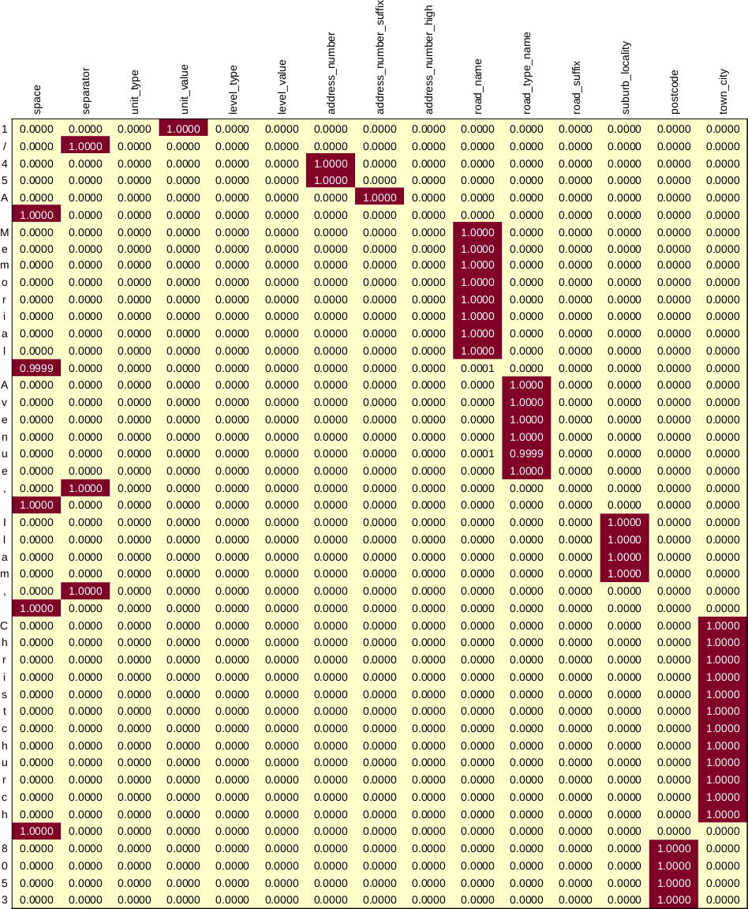

# LINZ Address Parser

This repo contains code that can be used to train a bi-directional LSTM model using [LINZ addresses](https://data.linz.govt.nz/layer/105689-nz-addresses/), which we can then use to parse address strings into constituent components.  We treat an adddress string as a sequence of characters, and we seek to assign a label to each.  E.g.



So, for example, road name is then just the ordered set of characters that have been assigned the label of `road_name`--`['M', 'e', 'm', 'o', 'r', 'i', 'a', 'l']`, in this case.

Note that the method is similar to [AddressNet](https://github.com/jasonrig/address-net) for Australian addresses.


# Getting Started

The library is provided as an [sbt](https://www.scala-sbt.org/) project.  A fat jar can be made simply by running:

```bash
sbt assembly
```

The library uses [deeplearning4j](https://deeplearning4j.konduit.ai/) which is a relatively large library.  If we build a fat jar with dl4j included it will be relatively large--about 100MB.  Also, if training a model, things will run much faster using CUDA.  To do this, make sure the file `./project/Dependencies` looks as follows:

```scala
import sbt._

object Dependencies {
  /*
  lazy val dl4jcore = "org.deeplearning4j" % "deeplearning4j-core" % "1.0.0-M1.1"
  lazy val nd4j = "org.nd4j" % "nd4j-native-platform" % "1.0.0-M1.1"
  */
  /**/
  lazy val dl4jcore = "org.deeplearning4j" % "deeplearning4j-cuda-11.2" % "1.0.0-M1.1"
  lazy val nd4j = "org.nd4j" % "nd4j-cuda-11.2-platform" % "1.0.0-M1.1"
  /**/

  ...

}
```

It's up to the user to ensure you have a compatible CUDA installation available.  That said, I found [NVIDIA's CUDA toolkit](https://docs.nvidia.com/datacenter/cloud-native/container-toolkit/install-guide.html) and [Docker images](https://hub.docker.com/r/nvidia/cuda) the easiest path, and a siimple Docker setup is provided for those interested.  Once a mepeodel is trained, and all users wish to do is parse individual addresses, the CPU version will suffice.  In that case, just ensure `./project/Dependencies.scala` looks as follows:

```scala
object Dependencies {
  /**/
  lazy val dl4jcore = "org.deeplearning4j" % "deeplearning4j-core" % "1.0.0-M1.1"
  lazy val nd4j = "org.nd4j" % "nd4j-native-platform" % "1.0.0-M1.1"
  /**/
  /*
  lazy val dl4jcore = "org.deeplearning4j" % "deeplearning4j-cuda-11.2" % "1.0.0-M1.1"
  lazy val nd4j = "org.nd4j" % "nd4j-cuda-11.2-platform" % "1.0.0-M1.1"
  */

  ...

}
```

To train a model, it's easiest to just use the sbt console:

```bash
$ sbt
$ console
```

To train a model, we then just do this:

```scala
import org.cmhh.linzaddressparse._

val m = model.lstm(Vocab.size, Labels.size)
val it = AddressDataSetIterator.train
m.fit(it)
m.save(new File("model.mdl"))
```

The trained model can then be used as follows:

```scala
utils.parse("1/45A Memorial Avenue, Ilam, Christchurch 8053")(m).toJson
```
```json
{
  "unit_type":null,
  "unit_value":"1",
  "level_type":null,
  "level_value":null,
  "address_number":"45",
  "address_number_suffix":"A",
  "address_number_high":null,
  "road_name":"Memorial",
  "road_type_name":"Avenue",
  "road_suffix":null,
  "suburb_locality":"Ilam",
  "town_city":"Christchurch",
  "postcode":"8053"
}
```

A pre-trained model is provided as `src/main/resources/model.mdl`, as is a _very_ basic entrypoint which can make use of it:

```bash
java -cp target/scala-2.13/linzaddressparse.jar \
  org.cmhh.linzaddressparse.AddressParse \
  "1/45A Memorial Avenue, Ilam, Christchurch 8053"
```
```json
{
  "unit_type":null,
  "unit_value":"1",
  "level_type":null,
  "level_value":null,
  "address_number":"45",
  "address_number_suffix":"A",
  "address_number_high":null,
  "road_name":"Memorial",
  "road_type_name":"Avenue",
  "road_suffix":null,
  "suburb_locality":"Ilam",
  "town_city":"Christchurch",
  "postcode":"8053"
}
```